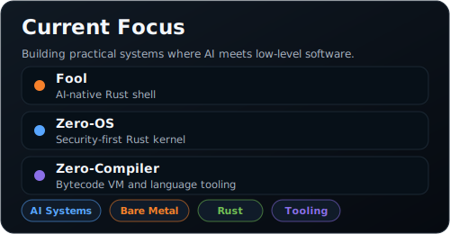
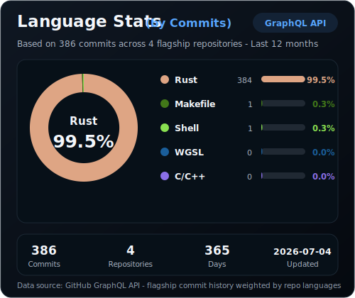
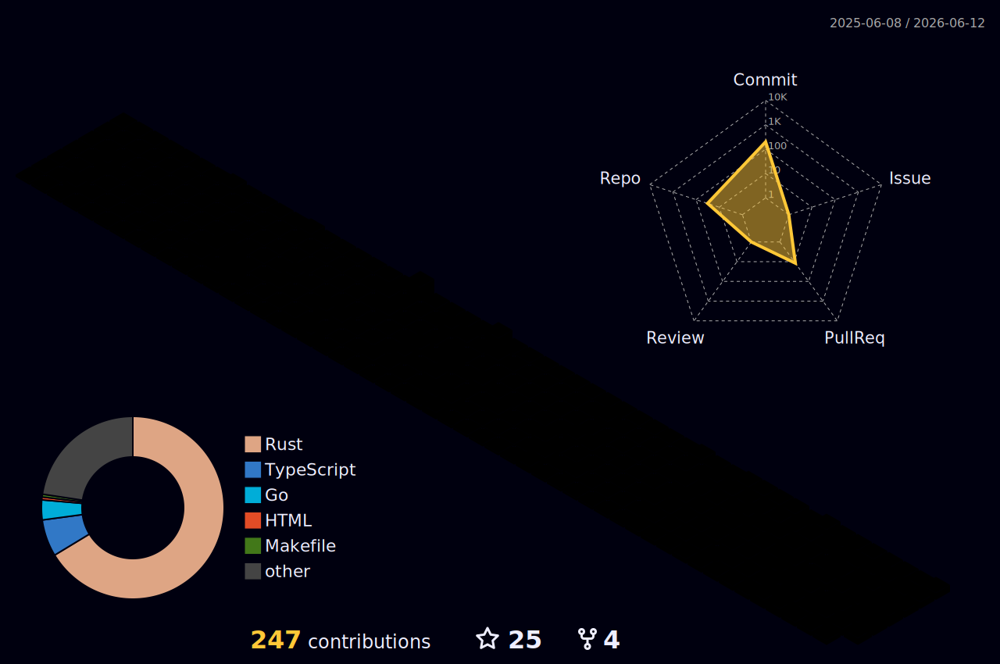

<!--
This README is generated by build_readme.py.
Edit build_readme.py for structural changes, then run: uv run python build_readme.py
Last generated: 2026-07-12 03:36 UTC
-->

 

## About Me

<table>
<tr>
<td width="58%" valign="top">

I work across the abstraction stack: training AI systems, building developer tools, and exploring operating-system internals.

**What I Do**

- Build and train neural networks and AI-powered tools.
- Design secure, production-grade OS kernel experiments in Rust.
- Create intelligent systems that can run close to the hardware.

**Current Flagship Projects**

- **[Fool](https://github.com/YUZHEthefool/Fool)** - A modern Rust shell with native AI assistance.
- **[Zero-OS](https://github.com/Zero-kernel/Zero-os)** - A security-first monolithic kernel written in pure Rust.
- **[Zero-Compiler](https://github.com/YUZHEthefool/Zero-Compiler)** - A modern bytecode language and virtual machine.
- **[zpdf](https://github.com/Xero-Team/zpdf)** - PDF tooling from the Xero-Team ecosystem.

**Tech Interests**

- Rust for systems, safety, shells, and kernels.
- Python for deep learning and automation.
- Linux, Docker, compilers, and low-level tooling.

**Belief**

> Nothing is True, Everything is Permitted.

</td>
<td width="42%" valign="top">

 

</td>
</tr>
</table>

## Tech Stack

## GitHub Overview

<table>
<tr>
<td width="58%" valign="top">

**Metrics**

</td>
<td width="42%" valign="top">

**Stats**

**Language Stats**

**3D Contribution**

**Pinned Projects**

</td>
</tr>
</table>

## Connect

I'm open to discussing OS development, AI tooling, systems programming, and collaboration opportunities.

