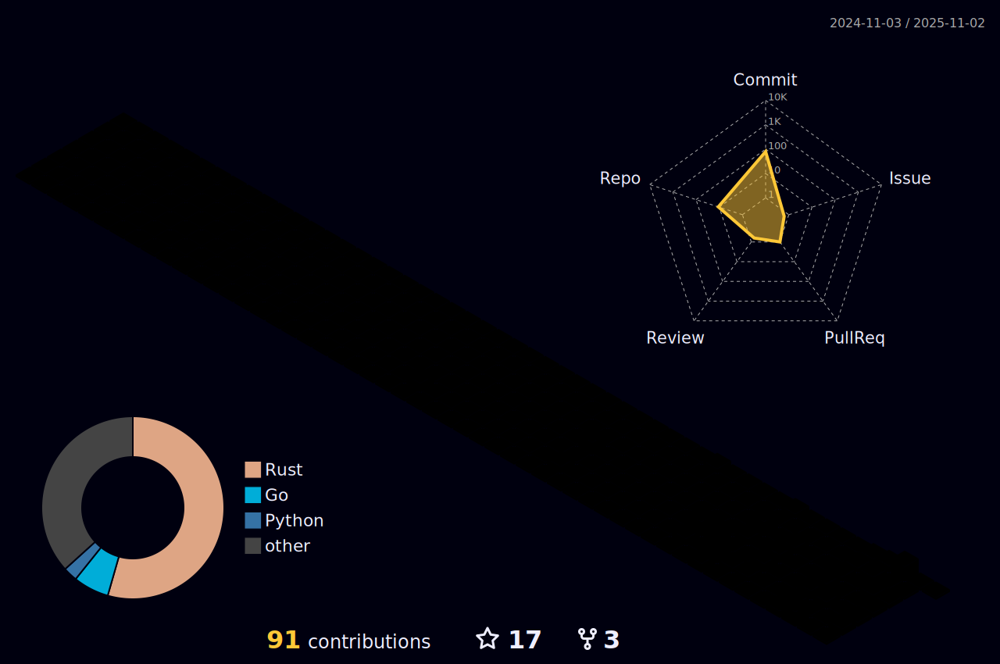

 

## About Me

<table>
<tr>
<td width="50%">

### Who Am I?

I'm a developer who operates at both ends of the abstraction spectrum.

**What I Do:**

- **By Day:** Build and train large-scale neural networks.
- **By Night:** Descend into low-level systems to craft an OS kernel from scratch.
- **Focus:** Bridging the gap between intelligent systems and bare metal.

**My Tech Interests:**
- 🦀 Rust & C
- 🧠 Python & AI
- 🐧 Linux & Docker

**My Belief:**
> *"First, solve the problem. Then, write the code."*

</td>
<td width="50%">

</td>
</tr>
</table>

### Tech Stack

 

---

## GitHub Metrics

---

## 3D Contribution

  

---

## Pinned Projects

  
  

---

 

## Let's Connect

I'm always open to discussing new projects, creative ideas, or opportunities to be part of something amazing.

 

  <a href="https://github.com/YUZHEthefool">
    <picture>
      <!-- Dark mode version -->
      <source media="(prefers-color-scheme: dark)" srcset="https://raw.githubusercontent.com/YUZHEthefool/YUZHEthefool/output/github-contribution-grid-snake-dark.svg" />
      <!-- Light mode version -->
      <source media="(prefers-color-scheme: light)" srcset="https://raw.githubusercontent.com/YUZHEthefool/YUZHEthefool/output/github-contribution-grid-snake.svg" />
      
    </picture>
  </a>

